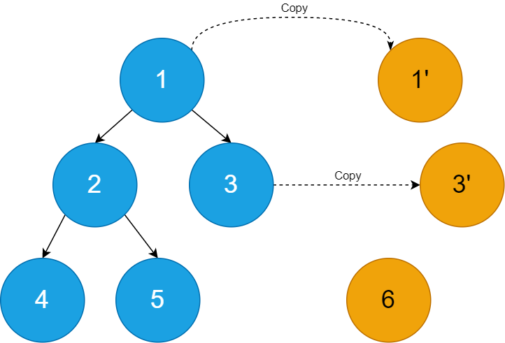
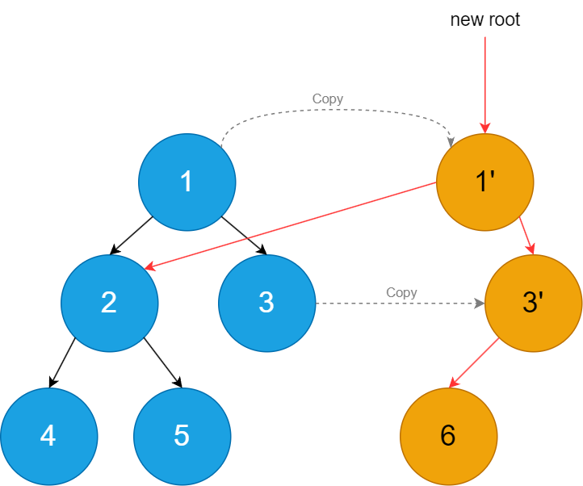
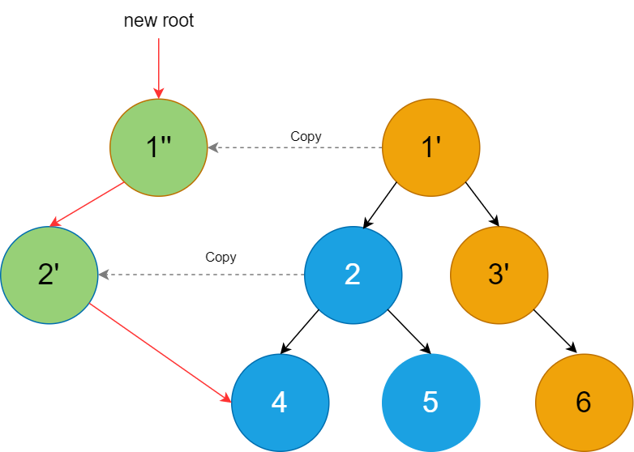

### 一、Immutable Data的概念
Immutable Data，不可变数据结构（下文为方便简称为ImmuData）。从名字可以看出其最重要的特性，即产生后便无法修改原始内容的一种数据结构（待资料收集）。它本身更多是一种设计思想，而不是具体的一套逻辑。
Immudata在数据库（1.待资料收集 2. 有没有可能搜索到论文？）得到了比较广泛的应用——一些文章直接将数据库按照基于可变数据结构或者不可变数据结构划分为了两类。
对Python比较熟悉的同学可能会联想到Python中的`tuple`、`list`类型变量，事实上前者确实是一种Immutable对象，而后者则是Mutable对象。当`tuple`被创建后，即无法再被修改；而对`list`的写操作则会直接覆盖掉原始的数据。

### 二、如何对Immutable Data进行操作
一份无法进行修改的数据？那要如何体现代码逻辑对数据的增、删、改呢？听起来似乎有点反直觉。
我们再回想Python中，是不是有一种变量既是不可变的，同时又是经常被修改的？
python中的string变量就是具有这样的不可变属性，这也是为什么如果我们尝试修改string中某位字符会报错的原因：

~~~
test_string = "Hellow World!"
test_string[0] = 'h'
print(test_string)

Traceback (most recent call last):  
File "my_py_console.py", line 4, in <module>
    test_string[0] = 'h'
TypeError: 'str' object does not support item assignment
~~~
所以对python字符串的写操作都是建立在一份新的copy上（如`replace`方法）。这也是对Immutable数据结构进行写操作的基本思路，即拷贝一份再做修改，这样就保证了旧数据的不变。相应的，后续的修改都会基于最新数据的copy来进行。随着持续的操作，我们会得到**一份数据一系列的“快照”**——记录了从最初到最后的所有状态。

但每次写操作之前都深拷贝一份数据未免太过消耗内存。字符串的消耗也许还能接受，但如果是复杂且频繁修改的数据结构，这开销可就真的让人难以接受了。所以我们需要一种更轻巧的拷贝方式。  
以对Immutable Tree的操作为例，下面图1中左侧蓝色节点为Immutable Tree原本的结构，现在我们尝试为3号节点增加一个新的叶节点6。  
#### 1. 为Immutable Tree新增一个节点

图1 Step1 新增所需的叶节点。

图2 Step2 重连叶节点。

第一步，生成新节点：  
从根节点到目标节点沿途的所有节点，如图1中所示，即为1，3，6三个节点。6是从无到有新创建的节点，而1'，3'实际是直接拷贝得到的“新节点”。  
  
第二步，重连节点：  
如图2中红线所示，即为新增的节点连接关系。除了连接新创建的节点，还将新的节点1'与原本的2号节点相连，并将1'指定为这棵树新的根节点。  
至此，我们就得到了添加了6号节点的新的树。  
  
**那如果我们继续操作，如删除掉原本的5号节点呢？**  
与增加新节点的流程类似，首先我们创建新的节点：  

第一步，生成新的节点:  
从根节点(1')到目标节点(2)，通过拷贝我们得到了1''以及2'两个新节点。  

第二步，重连节点：  
将1''与2'、2'与4号节点相连。同时将1''指定为新的根节点。  
一个有意思的现象是，“被删除”的5号节点其实依然在我们的内存中，只是从我们新的根节点1''无法访问到它了。这也是不可变数据“不可变性”的体现。

图3 删除过程中，新建节点以及重连节点的示意图。

上面讲解了树状结构的数据如何做到不可变性，那像List数据结构又如何做到不可变性呢？
可以参阅这篇文章<https://hypirion.com/musings/understanding-persistent-vector-pt-1>  
使用树状结构来模拟Vector的特性。

### 三、采用Immutable Data设计带来的好处
1. 完整的历史副本信息  
因为每次操作都会基于最新的一份数据Copy来进行，所以过往所有的数据状态都会被保留。当我们拥有了完整的历史快照后，能够很便捷地实现撤销和重做功能。  

2. 天然的数据驱动设计  
假设我们现在的需求是实现一个编辑器工具。因为Immutable Data结构内部始终维护着一份最新的完整数据，如一个界面的刷新操作，完全可以只基于这一份数据来进行，类似当下声明式UI的思路。而用户对界面操作所带来的数据修改，也只需要反馈到这一份Immutable Data上，界面与界面之间并不会形成数据传递的耦合关系。  
所以我觉得Immutable Data是一种天然符合数据驱动设计的数据结构。

3. 线程安全  
这是我觉得Immutable Data最有潜力的一点。  
（1）多线程读写  
对于多线程同时读写的情况，读取的是最新状态的数据，而写入的是最新状态数据的copy，两者不是同一个对象，所以这种情况是不用加锁的。  
（2）多线程写  
对于多线程同时写入的情况，因为每个线程的写操作都是在原始数据的copy上进行的，所以这一步也不会造成冲突。但在最后更新根节点这一步，需要防止多个线程在完成自己的写操作后，完成各自的根节点更新操作，出现多个有效的根节点，最终会导致某些线程的写结果丢失。  
一个简单的方式是将更新根节点的操作实现为原子操作，当某个线程执行这步操作失败后，意味着有其他线程率先完成了写入操作。本线程需要再次基于最新数据Copy进行一次写入操作。  
这部分内容更详细的说明可以参考参考资料3中的“Lock-free Data Structure”章节。

>参考资料：  
1. https://terminusdb.com/blog/9-reasons-why-you-need-an-immutable-database/
2. https://www.moderntreasury.com/learn/data-immutability  
3. https://io-meter.com/2017/08/06/from-immutable-to-lsmt/  
4. https://hypirion.com/musings/understanding-persistent-vector-pt-1

